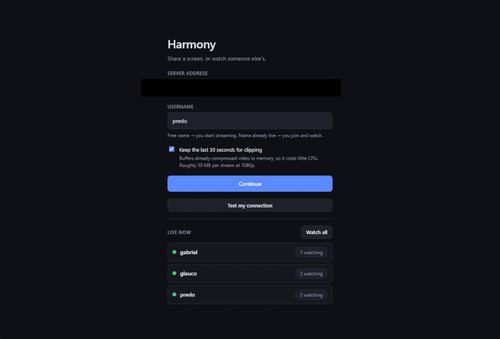
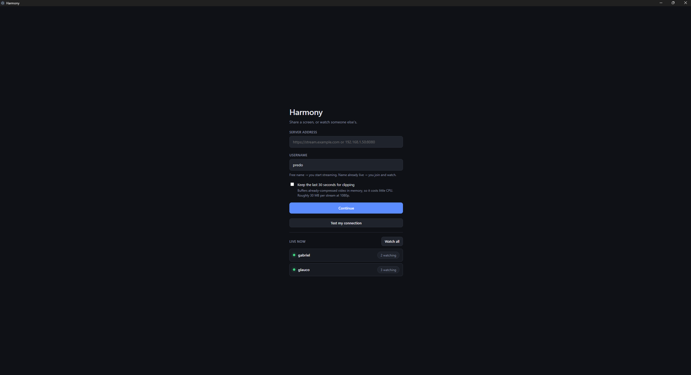
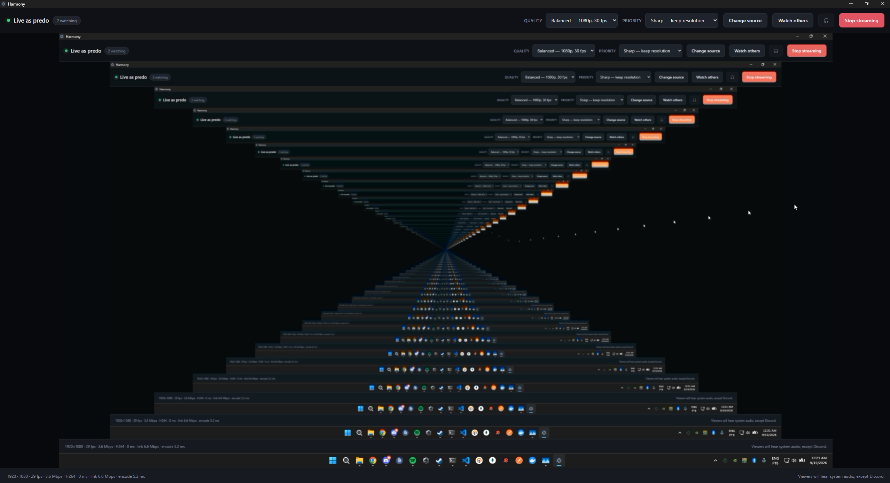
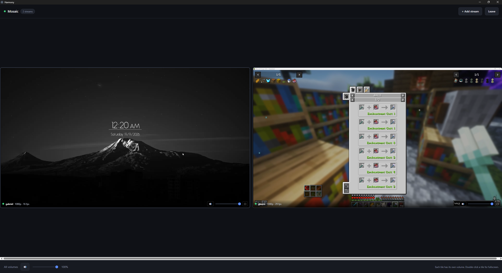

# Harmony

> [!WARNING]
> ## 🤖 This project was entirely vibecoded
>
> **Every line of this repository — client, server, tests and these docs — was
> written by an AI coding assistant, prompted by a human who did not review it
> line by line.** It is a recreational project, built for fun and for a handful
> of friends to share screens with. Treat it accordingly.
>
> It does work: it has been run in production for a small group, the test suites
> are real (they drive two actual Electron clients through a real media server,
> nothing mocked), and the measurements quoted throughout this README were taken
> rather than guessed. But *working* and *production-grade* are different claims,
> and only the first one is being made here.
>
> **Before you put this anywhere that matters, know what it does not have:**
>
> - **One shared password at best, and no accounts at all.** A server password is
>   optional and off by default; without it, anyone who can reach the server can
>   broadcast or watch. Even with it, the password decides *whether* you are in,
>   never *who* you are — everyone who knows it can claim any free username and
>   watch anyone. Do not hand it to people you would not hand a house key.
> - **No security review, no audit, no fuzzing.** Untrusted input reaches a
>   media server and a native Windows audio module. Nobody has attacked this on
>   purpose.
> - **No rate limiting, no abuse controls, no quotas.** A single client can
>   saturate your upload.
> - **No high availability.** One host, no redundancy, no failover, no backups.
> - **No stability guarantees.** No versioning policy, no migration path, no
>   promise that tomorrow's commit will not break your setup.
>
> Use it on a LAN, or among people you trust, and enjoy it. If you need screen
> sharing that carries real consequences when it fails, use something with an
> operations team behind it. **No warranty — see [LICENSE](LICENSE).**

**Self-hosted screen sharing with sub-second latency, on hardware you already
have.** Sub-second glass to glass, because nothing is ever transcoded and there
is no playback buffer to scrub.

**There are no accounts and no passwords.** Type a username to start sharing
under it. Type a name someone else is already using, and you watch them instead.
That is the whole interaction model.

## Demo

<!--
  This is a GIF, not the .mp4, because GitHub will not play a video committed
  to a repository: raw.githubusercontent.com serves repo files as
  `Content-Type: application/octet-stream` with `X-Content-Type-Options:
  nosniff`, and that header forbids the browser from treating it as video/mp4.
  A <video> tag pointed at a file in this repo cannot work, relative or
  absolute. GIFs render inline and have no such problem.

  Regenerate after replacing preview_video.mp4 (crop removes the pillarbox):
    ffmpeg -i media/preview_video.mp4 -vf "crop=1592:1080:154:0,fps=15,\
    scale=1280:-1:flags=lanczos,split[a][b];[a]palettegen=stats_mode=diff:\
    max_colors=232[p];[b][p]paletteuse=dither=bayer:bayer_scale=5:\
    diff_mode=rectangle" -loop 0 media/preview.gif
-->



<sub>38 seconds, no sound. The same clip at full 1080p60 **with** audio:
[preview_video.mp4](media/preview_video.mp4) (2 MB).</sub>

<p align="center">
  
  
  
</p>
<p align="center">
  <sub>Connect · broadcast with live stats · watch several streams at once</sub>
</p>

```
Desktop client (Electron)                    Server (x86-64 or arm64 Linux)
┌────────────────────────┐                  ┌──────────────────────────────┐
│ desktopCapturer        │   WHIP over TLS  │ Harmony control server :8080 │
│   screen │ window      │ ─── signaling ─► │   • username reservation     │
│ loopback-capture       │                  │   • MediaMTX auth hook       │
│   system │ per-process │                  │   • live stream list         │
│ RTCPeerConnection      │   SRTP over UDP  │ MediaMTX :8889 / :8189       │
│   H.264, GPU encoded   │ ═══ media ═════► │   pure packet relay          │
└────────────────────────┘                  └──────────────────────────────┘
          ▲   WHEP + SRTP                                  │
          └────────────── viewers ─────────────────────────┘
```

## What the server needs

Almost nothing, and that is the whole design. **The server never touches a
pixel** — it does not decode, encode, transcode, re-mux or write to disk. The
broadcaster's GPU encodes H.264 and the server forwards the resulting RTP packets
untouched, so its cost per stream is a socket and a memcpy rather than a video
pipeline.

| | |
| --- | --- |
| **CPU** | Any 64-bit Linux box. **x86-64 and arm64** both work, as do armv7 and armv6. No GPU, no hardware encoder, no AVX. |
| **RAM** | 512 MB is comfortable. Nothing is buffered server-side. |
| **Disk** | ~150 MB installed. Nothing is recorded. |
| **Real ceiling** | **Your upload bandwidth.** Every viewer of every stream is a separate copy out of the server: one 8 Mbps broadcaster with three viewers is 24 Mbps up. |

Run in production on a **Raspberry Pi 5** (8 GB, Ubuntu 26.04 aarch64); the
relay and control server also run on **x86-64** on every pass of the e2e suite.
A mini-PC, an old laptop, a VPS or a NAS will all do — and a VPS with real upload
bandwidth is the better choice if your home connection is thin, because bandwidth
is the only resource this is ever short of.

The client is where the actual work happens: it encodes on the GPU and decodes
one stream per tile you open.

---

## Features

### Sharing

- **Screens, windows, and cameras or capture cards** — anything the OS exposes as
  a video input.
- **Audio follows what you share.** A whole screen sends system audio; a single
  window sends only that application's audio (Windows); a capture card takes its
  sound from an audio input you pick beside it.
- **Exclude one app from a screen share** — typically a voice-chat client, so your
  friends do not hear themselves.
- **Change what you are sharing, mid-stream**, without interrupting viewers.
  Quality and encoder priority are live too.
- **Hear your own outgoing audio** with the 🎧 button, for capture cards and
  microphones.
- **Hide the preview** while staying live. Drawing your own screen back at you
  is GPU work on top of whatever you are sharing, which is what makes a game
  feel stuttery at a high frame rate. It also detaches automatically while the
  window is minimised.
- **Five quality presets**, from 720p30/3 Mbps through 1080p60/12 Mbps to
  native-resolution 60 fps at 25 Mbps, and a **priority** switch deciding what
  the encoder sacrifices when the budget runs out — *Sharp* keeps resolution so
  text stays readable, *Smooth* keeps frame rate so motion stays fluid.
- **GPU encoding** (NVENC, AMF, Quick Sync) is used automatically where the
  driver offers it — measured at 18–46% less encode time — with software H.264
  as the automatic fallback. The stats line says which you are getting, and a
  toggle forces software if a driver ever produces a corrupt stream.

### Watching

- **Mosaic view** — watch every live stream at once, or hand-pick a few. The grid
  fits tiles to the window in both directions and reflows as people come and go.
- **Independent audio per tile**, each with its own mute and volume, scaled by a
  master slider in the footer. Nothing is exclusive.
- **Maximize one tile** (⤢) to fill the grid with a single stream while staying
  inside the window — so the rest of your desktop is still there. **Esc** or the
  same button goes back.
- **Fullscreen any tile** with the ⛶ button or a double-click; **Esc** or ✕ to
  leave. It is the real Fullscreen API, so it covers the taskbar.
- **Close a stream** (✕) you are not interested in. The connection is torn down
  rather than hidden, and it stays closed — the grid will not quietly reopen it
  three seconds later.
- **Broadcast and watch at the same time.** Your own stream is left out of the
  grid — the preview already shows it, and pulling it back down would spend the
  bandwidth twice.
- **Add a stream from inside a stream**: watching one person, pick another, and
  they appear beside them.

### Clips

- **Save the last 30 seconds** of any feed you are sending *or* watching, as an
  MP4 in `Videos/Harmony Clips`. Off by default; one toggle on the connect screen
  turns it on for every feed.
- **Nothing is re-encoded.** The buffer taps WebRTC's *encoded* frames, so a clip
  costs a memcpy rather than a second H.264 encode per feed.

### Connecting

- **An optional server password.** Off by default. Set one and nothing but the
  health check answers without it — including the media, since watch URLs then
  carry a token of their own. Wrong guesses are rate limited on an escalating
  ladder: three costs 5 minutes, then 10, 30, 60. The client asks the server
  whether a password is wanted and only shows the box if it is.
- **Works on networks that block UDP**, via an ICE-TCP fallback on the same port —
  no TURN relay, no third party, no per-gigabyte bill.
- **A connection test** on the connect screen walks health → session → STUN → SDP
  → media and tells you which step failed.
- **One portable .exe** of about 82 MB, no installer and no admin rights. Enter a
  server address once and it is remembered.

---

## Getting started

**Server, with Docker:**

```bash
docker run -d --name harmony \
  -p 8080:8080 -p 8889:8889 -p 8189:8189/udp -p 8189:8189/tcp \
  -e MTX_WEBRTCADDITIONALHOSTS=stream.example.com \
  -e HARMONY_SIGNALING_URL=https://stream.example.com:8444 \
  pedrolucasmiguel/harmony-server:0.1.0
```

`linux/amd64` and `linux/arm64`, so the same tag runs on a mini-PC or a
Raspberry Pi. Compose and `docker run` examples are in [docker/](docker/) —
read the note there about **not remapping the media ports**, which negotiate
perfectly and then play nothing.

**Server, without Docker:** clone the repo onto any Linux box, run
`sudo server/install.sh`, set two environment variables, forward port 8189 (UDP
**and** TCP). The installer picks the right MediaMTX build for your
architecture.

**Client:** `cd client && npm install && npm run build` gives you
`dist/Harmony-0.1.0-portable.exe`.

The full procedure — TLS on a line whose ISP blocks 80 and 443, dynamic IPs,
packaging, tests and a troubleshooting table — is in
**[DEPLOYMENT.md](DEPLOYMENT.md)**.

---

## Why it is built this way

**Relay, never transcode.** This is not a micro-optimisation, and the constraint
that forced it is worth stating plainly: the Raspberry Pi 5 has *no hardware
H.264 encoder at all* (the Pi 4's was dropped), so a design that transcoded would
have been capped at a few frames per second there. Building for the weakest
plausible host is why it now runs on anything — an arm64 SBC, an x86-64 mini-PC,
a cheap VPS — and why adding viewers costs bandwidth rather than CPU.

**Two independent locks on a username.** A short-lived token claim in the control
server covers the seconds between picking a name and the first packet arriving;
`overridePublisher: no` in MediaMTX means that even with a valid token, a second
publisher cannot take a live path away from whoever holds it. Neither lock
depends on the other being correct.

One wrinkle worth knowing, because it is measured in the e2e suite: MediaMTX
answers a WHIP offer *before* it decides whether that publisher may have the
path. A rejected second publisher therefore gets a perfectly successful handshake
and then streams into nothing. So the client does not trust the `201` — after
publishing it waits for the control server to confirm the stream is actually
live, and reports a clear error if it never appears.

**Liveness is never tracked, only observed.** The control server polls MediaMTX
and mirrors what it reports. If a broadcaster's laptop sleeps, the connection
drops, MediaMTX forgets the path, and the username frees itself. There is no
bookkeeping to leak.

**Media and signaling are separated on purpose.** Signaling is ordinary HTTP and
goes through a reverse proxy or a Cloudflare Tunnel happily. Media is UDP and
cannot: `cloudflared` has no public UDP support, so a tunnel alone would give you
a connection that negotiates perfectly and then plays nothing. The media port has
to be forwarded.

**Per-application audio is Windows-only.** Chromium's loopback capture is
system-wide; capturing a single app needs the Windows WASAPI process-loopback API
through the optional native `loopback-capture` module. On macOS and Linux a window
share falls back to whatever you pick in the client — silent by default, so other
applications' sound never leaks into a stream by accident.

---

## Notes from building it

Things that were surprising, measured rather than assumed, and worth knowing
before you change the code.

<details>
<summary><b>Chromium throttles a renderer you cannot see — down to 1 fps</b></summary>

A minimised or covered window drags the encoder to a few frames per second, which
looks exactly like a network problem and is not. The client disables it with
`backgroundThrottling: false` plus three matching command-line switches. If you
fork the client, keep them.

Separately, **low frame rates are usually a bitrate ceiling.** Measured on a
1080p screen full of motion: *Sharp* at a 4 Mbps ceiling gives ~31 fps at full
resolution, and raising the ceiling to 10 Mbps takes it to ~58 fps still at 1080p.
Raise the preset before reaching for *Smooth*.
</details>

<details>
<summary><b><code>encodedInsertableStreams</code> is not free to leave switched on</b></summary>

With the flag set and nothing reading the encoded stream, Chromium keeps encoding
and sends *nothing at all* — measured at 178 frames encoded, 0 bytes sent. So the
flag is only set on connections whose frames something will actually read, which
is why toggling clips takes effect on the **next** stream rather than the current
one.
</details>

<details>
<summary><b>Clips carry Opus audio in MP4</b></summary>

Legal, and it plays in Chromium, VLC, ffmpeg and anything browser-based — but a
few older Windows players will show video with no sound. Converting to AAC would
need a decode/encode pass, which is the one cost this design exists to avoid.

Memory is simply bitrate × 30 s per stream: ~11 MB at the Low preset, ~30 MB at
Balanced, ~94 MB at Ultra, with a hard 192 MB ceiling and the oldest frames
dropped continuously.
</details>

<details>
<summary><b>ICE-TCP instead of a TURN relay</b></summary>

MediaMTX leaves its TCP media listener off by default, because TCP carries
real-time media badly — one lost packet stalls everything behind it, so a
congested link degrades into growing delay rather than dropped frames. That is
the right default for a server where everyone can use UDP, and the wrong one for
a self-hosted tool whose users sit on corporate and campus networks that drop UDP
outright. ICE only falls back to it when UDP fails, so it costs nothing when it
is not needed. Verified by stripping every UDP candidate from the server's answer
and confirming the session still connected.
</details>

<details>
<summary><b>The published audio track is created once and never replaced</b></summary>

Everything feeds a Web Audio mixer behind it. That is what lets you switch from a
screen to a webcam mid-stream without renegotiating: `replaceTrack()` changes the
video sender in place, and the audio change is just the mixer listening to
something else.
</details>

<details>
<summary><b>WASAPI excludes one process tree per capture</b></summary>

`PROCESS_LOOPBACK_MODE_EXCLUDE_TARGET_PROCESS_TREE` takes a single target. That
platform limit is why the audio-exclusion picker is single-select rather than a
list of checkboxes — not a simplification.
</details>

<details>
<summary><b>"My game reports 200 fps but feels like 20" while streaming</b></summary>

High frame rate with bad *pacing* is a different problem from low frame rate,
and on Windows it usually is not the encoder. Three things stack up:

**1. Mixed refresh rates are the big one, and it is not Harmony's doing.**
When a second monitor runs at a different refresh rate, DWM can tie desktop
composition to the lower of the two, and anything animating on the slow monitor
— a video preview, for instance — drags the game's presentation with it. The
frame counter stays high because frames are still being produced; they are just
delivered on someone else's schedule. The fixes that actually work are at the OS
level: match the refresh rates, run the game **borderless** rather than
exclusive fullscreen, or move the second display to the integrated GPU.

**2. Harmony keeps painting when a normal app would stop — deliberately.**
The three anti-throttling switches that keep the encoder alive while you look at
the game (see below) also stop Chromium from backing off when its window is
covered or parked on another monitor. So the preview kept being composited at
full rate, forever, on the same GPU as the game.

That part is fixed: **Hide preview** detaches the video element, and the window
detaches it automatically while minimised. Both keep streaming — detaching
`srcObject` stops the painting, while the sender holds the track independently
of anything displaying it. Verified end to end: the server received
**+1220 KB while the preview was hidden**. Mosaic tiles pause while minimised
for the same reason.

**3. On a two-GPU laptop, Harmony lands on the same GPU as the game — and
Chromium cannot composite across GPUs on Windows.** So if Harmony renders on the
discrete GPU while its window sits on a display wired to the integrated one,
every frame is copied between adapters. Measured on a hybrid laptop mid-game:

| Process | Adapter | Engine | % |
| --- | --- | --- | --- |
| The game | NVIDIA | 3d | 22.8 |
| **desktop compositor** | **Intel** | 3d | **13.3** |
| Harmony | NVIDIA | videoencode | 13.0 |
| **desktop compositor** | **NVIDIA** | 3d | **8.9** |
| Harmony | NVIDIA | 3d + videodecode + copy | 7.0 |

The compositor alone cost as much as the game. Harmony now detects this and
offers to move itself to the integrated GPU — one click, one restart. Quick Sync
encodes H.264 just as well as NVENC, so nothing is lost, and ~20% of the
discrete GPU goes back to the game.

Worth ruling out first: minimise Harmony entirely. If the stutter goes away, it
was compositing (1 and 2). If it does not, it is contention (3).

**It is not a canvas.** The preview is a `<video>` element fed the capture
stream directly — the only canvas in the client is a 160×90 test pattern used by
*Test my connection*.
</details>

<details>
<summary><b>NVENC, AMF and Quick Sync are already in use — there is nothing to integrate</b></summary>

This gets asked a lot, so it is worth writing down with numbers. On Windows,
Chromium already routes WebRTC's H.264 encoding through Media Foundation's
VideoEncodeAccelerator, which is a front end for whichever vendor encoder the
driver provides: **NVENC** on NVIDIA, **AMF/VCE** on AMD, **Quick Sync** on
Intel. There is no flag to switch on and no vendor SDK to link against.

Measured here by running the identical encode twice, once with Chromium's
hardware encoding disabled (1920×1080, H.264, `contentHint: 'detail'`, 8 Mbps
ceiling):

| Source | GPU | CPU only | Difference |
| --- | --- | --- | --- |
| Synthetic canvas, heavy motion | 5.3 ms/frame | 9.9 ms/frame | **−46%** |
| Real screen share | 8.1 ms/frame | 9.9 ms/frame | **−18%** |

The margin depends on the content — a busy frame is where the GPU pulls ahead.
Hardware **decoding** is on by default for viewers too.

**Software H.264 is the automatic fallback.** Chromium drops to OpenH264 on the
CPU when no hardware encoder exists or it fails to initialise, so a machine with
no usable GPU encoder still streams; it just spends more CPU doing it. Verified
by forcing the software path and checking it still encodes and sends.

**What Chromium will not tell you is which encoder a given stream ended up on.**
`encoderImplementation` is in the WebRTC stats spec, but it is absent from this
Electron build's `outbound-rtp` — confirmed by dumping every field the stats
object exposes, not by assuming. So the client reports the *capability*, from
`app.getGPUFeatureStatus()`, and the broadcast stats line ends in `GPU encode` or
`CPU encode`. A capability is an honest thing to report; a guess is not.

**One trap, which this project fell into before catching it.**
`getGPUFeatureStatus()` answers `disabled_software` until the GPU process has
reported, and that takes about 300 ms after the window loads — measured:

```
  17ms  app ready              video_encode=disabled_software
  66ms  did-finish-load        video_encode=disabled_software   <- the UI asks here
 170ms  +100ms                 video_encode=disabled_software
 382ms  +300ms                 video_encode=enabled
```

The client asks during start-up, which lands in the middle of that, so reading
once and keeping the answer reported "no GPU encoder" for the entire session on
a machine that was encoding on its GPU the whole time — Task Manager showing
18% Video Encode while the app insisted there was none. It now waits for the GPU
process to report (bounded, since a machine with no hardware encoder never
flips), caches the settled answer, and re-checks when a broadcast starts.

If you go measuring this yourself, do not trust a single early read.
</details>

<details>
<summary><b>Almost all of the 82 MB download is Chromium, not this app</b></summary>

Harmony's own code plus its two runtime dependencies is under a megabyte, so
shrinking the build means shrinking what Electron ships. Three measures took the
portable .exe from 95.7 MB to 82.2 MB:

| Change | Saved (uncompressed) |
| --- | --- |
| `electronLanguages: [en-US]` — Chromium ships 55 locale files | ~48 MB |
| Dropping `dxcompiler.dll` + `dxil.dll` — DirectX shader compilation for WebGPU, which this app has no use for | 27 MB |
| `compression: maximum` | — |

The 20 MB `LICENSES.chromium.html` stays: it is a licence-compliance
requirement, and it is text, so it compresses to almost nothing. `vk_swiftshader.dll`
also stays — it is only 6 MB, and it is what renders on a machine with no usable
GPU driver.

If a removal ever breaks a machine, the list is one array in
[client/scripts/after-pack.js](client/scripts/after-pack.js).
</details>

<details>
<summary><b>Fit tiles to the window in both dimensions, not just width</b></summary>

The mosaic tries every column count and keeps whichever makes each 16:9 tile
largest while still fitting the height. Sizing on width alone — the obvious
approach, and the first one here — had a real consequence: four tiles in two
columns of a wide window made rows taller than the window, and the bottom row's
volume and fullscreen controls sat below the fold where they could not be clicked
at all.
</details>

---

## Layout

```
server/
  mediamtx.yml            relay config — annotated, worth reading before changing
  src/rooms.js            username reservation
  src/mediamtx-api.js     liveness polling
  src/index.js            HTTP API + MediaMTX auth hook
  install.sh              installer (detects architecture)
client/
  src/main/               Electron main: capture, native audio, all HTTP
  src/preload/            the one bridge into the renderer
  src/renderer/           UI, WHIP/WHEP, PCM → WebRTC audio pipeline
  test/                   smoke (packaged builds), e2e (two real clients)
```

## Tests

```bash
npm --prefix server test          # reservation logic + auth hook
npm --prefix client test          # launches the app, drives it over CDP

MEDIAMTX_BIN=/path/to/mediamtx npm --prefix client run test:e2e
```

The e2e suite starts MediaMTX and the control server, then drives two Electron
clients — one publishes its screen over WHIP, the other enters the same username
and must end up decoding that video over WHEP. Nothing is mocked.

## Known limits

- **One stream per username.** That is the design, not a bug.
- **No accounts.** The optional server password is one shared secret, not
  identity: anyone who knows it can claim any free username. Without it, so can
  anyone who can reach the server.
- **No recording on the server.** MediaMTX can do it without re-encoding
  (`record: yes` in `pathDefaults`) but it is off — partly because an SD card is a
  poor place for video, partly because writing to disk is the one thing that
  would give the server a cost that scales. Client-side clips cover the common
  case.
- **No adaptive simulcast.** Every viewer gets the broadcaster's single encoding.
  Adding simulcast would move work onto the broadcaster rather than the server,
  so it is feasible — just not done.
- **Viewer "pause" freezes on the last frame** and resumes at live. There is no
  buffer to scrub, which is the normal trade for sub-second latency.

## Built on

[MediaMTX](https://github.com/bluenviron/mediamtx) · [Electron](https://www.electronjs.org/)
· [mp4-muxer](https://github.com/Vanilagy/mp4-muxer) · [loopback-capture](https://www.npmjs.com/package/loopback-capture)

## License

MIT
