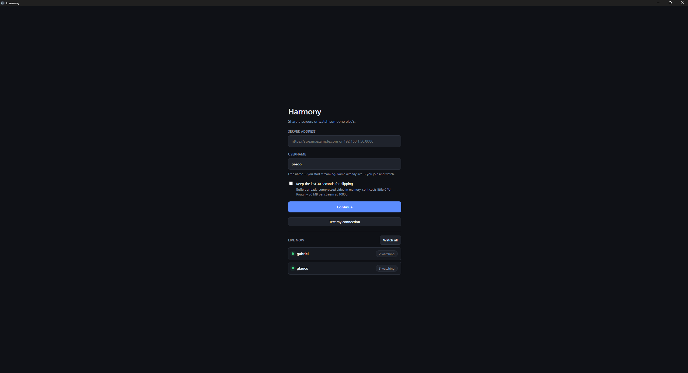
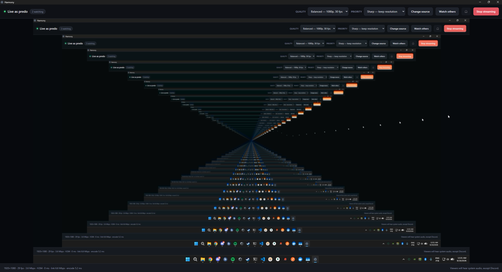

<p align="center">
  
</p>

# Harmony

**Self-hosted, low-latency screen sharing and voice chat for a group of friends.**
A small Discord you run yourself: voice channels with screen and camera sharing,
text channels, and sub-second latency, because the server only relays video and
never re-encodes it.

<p align="center">
  
  
  
</p>

## Features

- **Screen, window or capture-card sharing** at up to native resolution and
  120 fps, H.264 encoded on your GPU. Per-app audio on Windows.
- **Voice channels** with cameras and screen shares, per-person volume up to
  350%, mute, deafen and an admin soundpad.
- **Text channels** with Markdown, attachments, reactions, custom emoji,
  mentions, pins and search.
- **Accounts and roles**: owner, admins and members, with optional
  password-locked channels.
- **Runs on almost anything.** The server never decodes a frame, so a
  Raspberry Pi is plenty; upload bandwidth is the only real limit.

## Quick start

**Server** (any 64-bit Linux, x86-64 or arm64):

```bash
sudo server/install.sh
```

or with Docker. See [docker/](docker/).

**Client:** download it from
[Releases](https://github.com/PedroLucasMiguel/harmony/releases/latest).
Windows (`-setup.exe`), Linux (`.AppImage`) and macOS (`.dmg`). The app
offers new versions itself: it installs them itself on Windows and Linux,
and on macOS it opens the download page.

The builds are unsigned:
- **Windows:** SmartScreen may ask on the first install. Choose *More info → Run anyway*.
- **macOS:** right-click the app → *Open* the first time.

To build it yourself:

```bash
cd client && npm install && npm run build   # -> dist/Harmony-<version>-setup.exe
```

**Releasing:**
1. Bump `version` in `client/package.json` and commit.
2. Push a matching tag: `git tag v3.1.0 && git push origin v3.1.0`.

GitHub Actions builds all three and publishes the release.

TLS, dynamic IPs, ports and troubleshooting are covered in
**[DEPLOYMENT.md](DEPLOYMENT.md)**.

## Built on

[MediaMTX](https://github.com/bluenviron/mediamtx) ·
[Electron](https://www.electronjs.org/) ·
[loopback-capture](https://www.npmjs.com/package/loopback-capture) ·
[mp4-muxer](https://github.com/Vanilagy/mp4-muxer)

## License

MIT, see [LICENSE](LICENSE).

---

## Disclaimer: vibe-coded

> [!WARNING]
> **Every line of this repository (client, server, tests and docs) was written
> by an AI coding assistant**, prompted by a human who did not review it line by
> line. It is a recreational project, built for fun and for a handful of
> friends.
>
> It works and has run for a small group, but it has had **no security review,
> no audit and no abuse controls**, and comes with **no stability guarantees**.
> Use it on a LAN or among people you trust, not for anything that matters when
> it breaks. **No warranty.**
